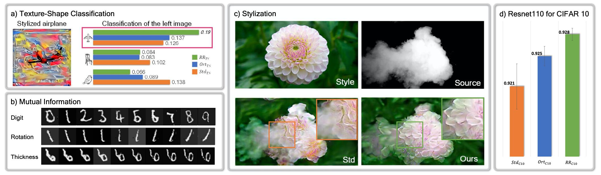
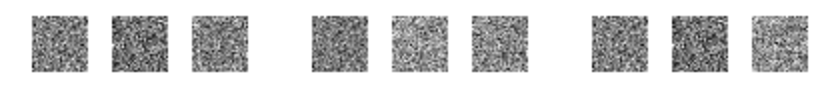

# Data-driven Regularization via Racecar Training for Generalizing Neural Networks

This is the source code repository for our paper
"Data-driven Regularization via Racecar Training for Generalizing Neural Networks".
This repository contains example code to train the MNIST and peak models mentioned in our paper. We also provide an example to analyze the weights via SVD to verify differences among racecar trained model (RR), standard model (Std) and models trained with orthogonal constraints (Ort). I.e., the code here can be used to reproduce Fig. 3 in our paper.




## Abstract:

We propose a novel training approach for improving the generalization in neural networks.  We show that in contrast to regular constraints for orthogonality, our approach represents a {\em data-dependent} orthogonality constraint, and is closely related to singular value decompositions of the weight matrices.  We also show how our formulation is easy to realize in practical network architectures via a reverse pass, which aims for reconstructing the full sequence of internal states of the network.  Despite being a surprisingly simple change, we demonstrate that this forward-backward training approach, which we refer to as "racecar" training, leads to significantly more generic features being extracted from a given data set.  Networks trained with our approach show more balanced mutual information between input and output throughout all layers, yield improved explainability and, exhibit improved performance for a variety of tasks and task transfers.

Pre-print: <https://arxiv.org/pdf/2007.00024.pdf>

Lab Website: <https://ge.in.tum.de/publications/2020-xie-racecar/>

## Prerequisites

* [tensorflow](https://www.tensorflow.org/install) >= 1.14
* [numpy](https://numpy.org/install/)  >= 1.18.1

## Files

* Folder "MNIST/" and "peak/" contain the data sets used for MNIST and peak tests, respectively.
* "mnist_training.py" and "peak_training.py" are used to run the MNIST and peak training.
* After training, "kernel_SVD.py" can be used to compute the SVD of the weights in the first layer of the trained models.

## Running the tests
You can run the whole chain by executing
```
python RUN_ME.py
```



This will train all three models: Std, Ort and RR for both tests, and will create the following outputs:
* the directories "MNIST|peak_RR|Ort|Std/test_0000/" with trained models, and training information (training loss in "trainloss.txt", the elapsed time for 100 epochs in "elapsedtime.txt", testing accuracy in "testaccuracy.txt")
* "MNIST|peak_RR|Ort|Std/test_0000/backwardtest_img/" contain re-generated images $d_{1}^{'}$, i.e. they execute inverted network via the backward path, over the course of the full training process. These outputs are shown in the GIF above for three examples (with Std, Ort, RR f.l.t.r. in each).
* "MNIST|peak_RR|Ort|Std_SVD_0000_0049/" contain images of the SVD of the first layer's weight matrix of the trained model. By default, we only output 10 images from the right singular vectors. More right/left singular vectors can be generated by modifying line 38-43 in "kernel_SVD.py".
